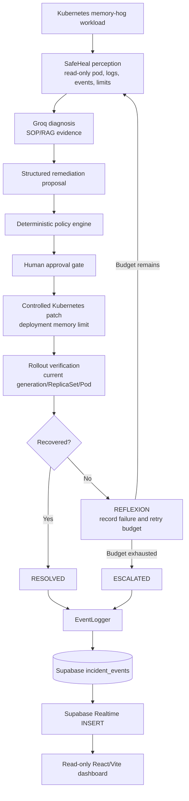

# SafeHeal

SafeHeal is a policy-controlled AI agent for bounded Kubernetes self-healing. It detects an `OOMKilled` workload, gathers read-only evidence, asks Groq for a structured remediation proposal, evaluates that proposal with deterministic policy rules, requests human approval, applies a narrowly scoped memory-limit patch, verifies the current rollout, and records the workflow in Supabase for a realtime dashboard.

SafeHeal is a hackathon prototype for controlled automation. The AI proposes actions; deterministic code, Kubernetes permissions, and a human approval gate constrain execution.

## Problem

Kubernetes can restart a container after it exceeds its memory limit, but diagnosing the failure and deciding whether an infrastructure change is safe still requires operational judgment. SafeHeal demonstrates a bounded workflow for one controlled failure mode: an `OOMKilled` `memory-hog` workload in the `safeheal-demo` namespace.

## SafeHeal Overview

- Kubernetes modules collect pod, log, event, deployment, and resource-limit evidence.
- Groq produces a structured Pydantic diagnosis and proposal.
- The policy engine validates namespace, operation, resource, attempt count, and memory-change magnitude.
- HITL requires approval for `increase_memory_limit`.
- The Kubernetes write path is limited to the approved deployment memory patch.
- Verification waits for the current Deployment generation and ReplicaSet rollout.
- Reflexion records failed attempts in memory and provides failure context to the next diagnosis cycle.
- `EventLogger` persists workflow events to Supabase when backend credentials are configured.
- The dashboard reads `incident_events` and subscribes to Realtime `INSERT` events; it performs no Kubernetes or database writes.

## Key Features

- Reproducible local `OOMKilled` simulation with Minikube.
- Read-only Kubernetes perception before remediation.
- Structured Groq proposal with SOP/RAG context.
- Deterministic policy enforcement independent of the LLM.
- Human-in-the-loop approval before memory changes.
- Bounded rollout verification against the current workload generation.
- In-memory reflexion store and hard retry budget.
- Escalation when policy, HITL, diagnosis, remediation, or verification cannot safely proceed.
- Supabase event persistence grouped by `run_id`.
- Realtime React timeline and action/policy ledger.

## Architecture



The LLM does not receive unrestricted Kubernetes access. The only Kubernetes write is implemented in `src/k8s/k8s_patch.py` and is called after policy and HITL approval.

## FSM Workflow

Normal workflow:

```text
DETECT -> INVESTIGATE -> DIAGNOSE -> PROPOSE -> POLICY_CHECK
  -> HITL -> REMEDIATE -> VERIFY -> RESOLVED
```

Failure paths include:

```text
REMEDIATE or VERIFY failure -> REFLEXION -> INVESTIGATE -> DIAGNOSE
  -> PROPOSE -> POLICY_CHECK -> retry or ESCALATED
```

An LLM proposal of `escalate`, a rejected policy decision, a rejected HITL prompt, an LLM error, a failed patch, or exhausted retries ends safely in `ESCALATED`.

## Safety Model

1. **Read-only investigation:** perception uses Kubernetes `get`/`list` operations for workload evidence.
2. **AI proposes:** Groq returns a structured proposal and never executes Kubernetes operations.
3. **Deterministic policy gate:** `config/policy_rules.yaml` restricts namespace, operation, resource, memory multiplier, and retry budget.
4. **Human approval:** `increase_memory_limit` requires the terminal HITL decision.
5. **Bounded remediation:** the patch module changes only the target deployment container memory limit.
6. **Verification:** the verifier observes Deployment generation, updated replicas, current ReplicaSet Pods, readiness, running state, and OOMKilled state.
7. **Retry cap:** `max_attempts` is enforced by code, not by the LLM. The current policy permits two failed attempts.
8. **Escalation:** failed safety checks and exhausted retry budgets stop the workflow without another remediation.

## Project Structure

```text
.
├── main.py                         # SafeHeal FSM entry point
├── config/policy_rules.yaml         # Deterministic safety policy
├── k8s/                             # Namespace, RBAC, Deployment, Service
├── knowledge/OOMKilled_SOP.md       # Diagnosis and remediation guidance
├── scripts/                         # Crash injection and focused exercises
├── src/
│   ├── agent/                       # Groq client, prompts, schemas, reflexion
│   ├── k8s/                         # Read-only access, patching, verification
│   ├── logging/                     # Supabase-backed EventLogger
│   ├── rag/                         # SOP retrieval
│   └── safety/                      # Policy engine and HITL gate
├── tests/                           # Python unit and FSM tests
├── workload/                        # Deliberately memory-hungry HTTP service
├── dashboard/                       # React/Vite/Supabase observability UI
├── requirements.txt
└── pytest.ini
```

## Prerequisites

- Ubuntu or another Linux development environment.
- Python 3 and a virtual environment.
- Docker, Minikube, and `kubectl`.
- Node.js and npm for the dashboard.
- A Groq API key for diagnosis.
- Supabase project credentials for backend event persistence.

The repository currently contains `.env` but no `.env.example`. Do not commit `.env` or document literal credential values.

## Installation and Environment

From the repository root:

```bash
python3 -m venv .venv
source .venv/bin/activate
python -m pip install -r requirements.txt
```

Set these variables in the repository-root `.env` file without committing their values:

```text
GROQ_API_KEY=<your Groq API key>
GROQ_MODEL=<optional Groq model override>
SUPABASE_URL=<your Supabase project URL>
SUPABASE_KEY=<server-side Supabase key>
```

The dashboard uses Vite variables in `dashboard/.env`:

```text
VITE_SUPABASE_URL=<your Supabase project URL>
VITE_SUPABASE_ANON_KEY=<your public/publishable Supabase key>
```

Install dashboard dependencies:

```bash
cd dashboard
npm install
cd ..
```

## Minikube Demo Environment

```bash
minikube start
eval $(minikube docker-env)
cd workload
docker build -t memory-hog:latest .
cd ..
```

Apply the repository manifests:

```bash
kubectl apply -f k8s/namespace.yaml
kubectl apply -f k8s/rbac.yaml
kubectl apply -f k8s/deployment.yaml
kubectl apply -f k8s/service.yaml
kubectl get pods -n safeheal-demo
```

## Run the Demo

1. Wait for the workload to be Running.
2. Optionally watch the Pod:

   ```bash
   kubectl get pods -n safeheal-demo -w
   ```

3. Trigger the reproducible memory failure:

   ```bash
   ./scripts/inject_crash.sh
   ```

4. Confirm restart/OOM evidence:

   ```bash
   kubectl describe pod -n safeheal-demo -l app=memory-hog
   ```

5. Start SafeHeal from the repository root:

   ```bash
   source .venv/bin/activate
   python main.py
   ```

6. Review the proposal and answer the HITL prompt. Enter `y` only when you approve the displayed bounded remediation. Entering `n`, pressing Enter, EOF, or interrupting the prompt rejects the action safely.

## Dashboard

Start the read-only dashboard:

```bash
cd dashboard
npm run dev
```

Open the URL printed by Vite, normally `http://localhost:5173`.

The dashboard loads existing `public.incident_events` rows, groups them by `run_id`, shows the current FSM timeline and ledger, and subscribes to Realtime `INSERT` events. Incoming events are deduplicated, chronologically sorted, and rendered without a browser refresh. `REFLEXION` and `ESCALATED` are also represented. The dashboard has no Kubernetes action or database-write controls.

Build it with:

```bash
cd dashboard
npm run build
```

## Testing

From the repository root:

```bash
source .venv/bin/activate
pytest -q
```

Focused exercises are also available:

```bash
python scripts/test_perception.py
python scripts/test_reasoning.py
```

The perception exercise reads Kubernetes evidence. The reasoning exercise sends mock evidence through Groq and requires configured Groq credentials.

## Validation Results

- Stage 3 policy/HITL tests: `10/10`.
- Stage 5 tests: `48/48`.
- Full Python suite after Stage 6: `50/50`.
- Python compilation: passed.
- `pip check`: passed with no broken requirements.
- Dashboard `npm run build`: passed.
- Real Minikube remediation runs observed `320Mi -> 480Mi`, `480Mi -> 600Mi`, and `600Mi -> 750Mi` memory-limit changes.
- Backend Supabase event persistence: validated.
- Supabase Realtime INSERT delivery to the dashboard: validated without a browser refresh.

These are hackathon validation results, not a claim of production readiness.

## Supabase and Realtime

`src/logging/event_logger.py` records `id`, `run_id`, `timestamp`, `event_type`, `stage`, `status`, `message`, and `metadata` in `incident_events`. The backend uses `SUPABASE_URL` and `SUPABASE_KEY`. The dashboard uses `VITE_SUPABASE_URL` and `VITE_SUPABASE_ANON_KEY` for read-only SELECT queries and Realtime `INSERT` subscriptions.

Supabase Realtime must be enabled for `public.incident_events`, and the dashboard’s public key must be allowed to read the table. The dashboard does not write to Supabase.

## Safety Considerations

- Keep backend and dashboard credentials separate.
- Never commit `.env` files, API keys, or Supabase secrets.
- Review the policy file before running a remediation.
- Treat the HITL prompt as an approval boundary.
- Do not grant the AI arbitrary shell or Kubernetes access.
- Use the local Minikube workload for demonstrations.

## Future Improvements

- Add a checked-in `.env.example` containing variable names only.
- Add dedicated integration tests for Supabase persistence and dashboard Realtime delivery.
- Replace the in-memory reflexion store with an explicitly designed durable store if cross-process history is required.
- Add richer workload and diagnosis support while preserving deterministic policy gates.
- Add deployment hardening and production observability.

## Project Information

**Project:** Kubernetes-Self-Healing-Agent
**Name:** SafeHeal
**Purpose:** Demonstrate policy-controlled AI-assisted Kubernetes self-healing with human approval, bounded remediation, verification, reflexion, event persistence, and realtime observability.
